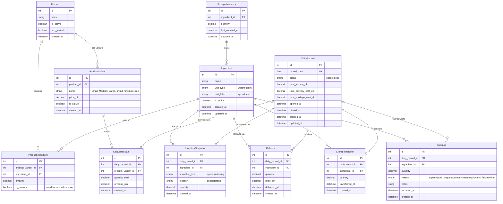
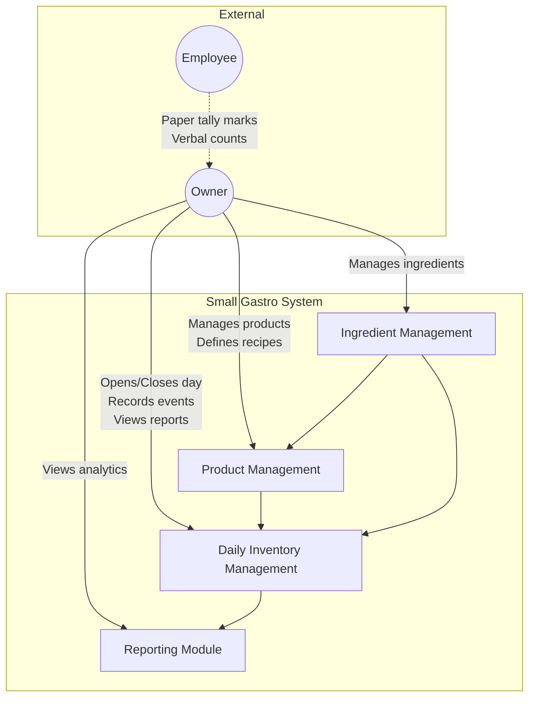
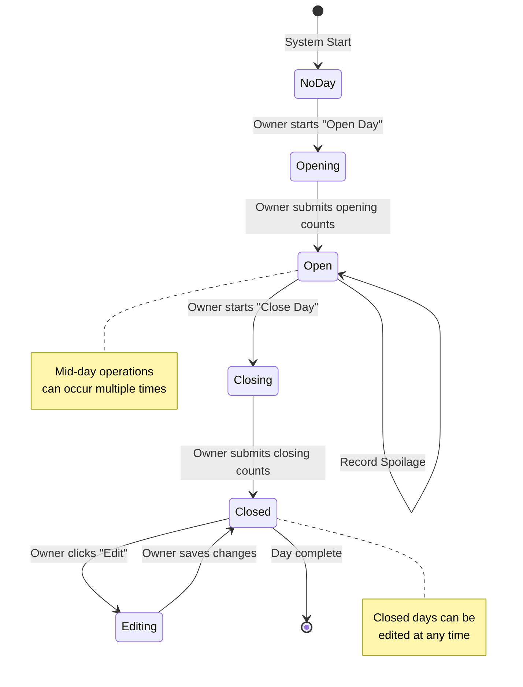
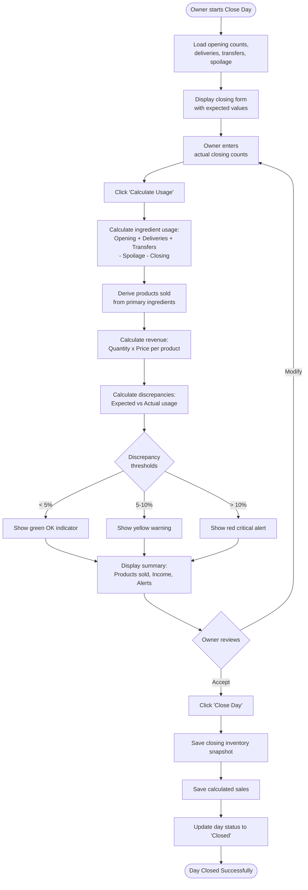
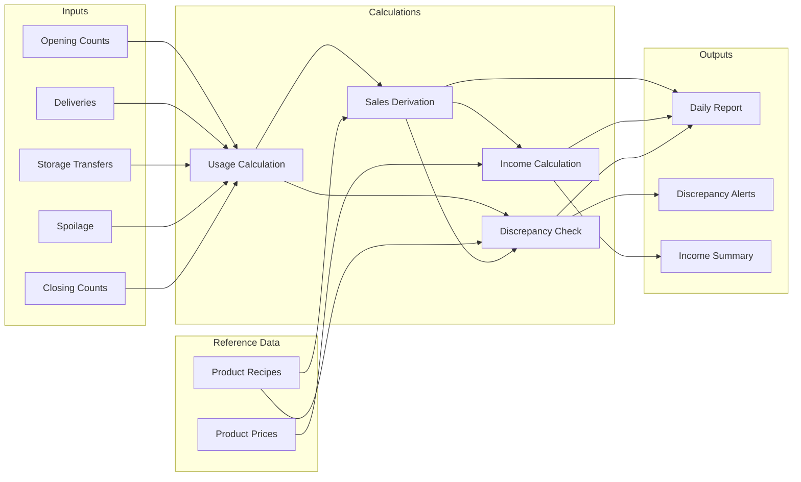
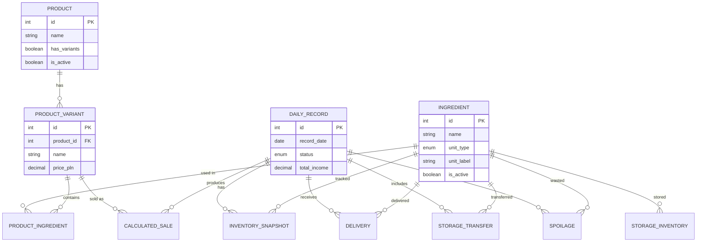

# Daily Inventory Management - Requirements Specification

**Document Version:** 1.0
**Date:** 2026-01-01
**Status:** Approved
**Author:** Requirements Analyst Agent

---

## 1. Executive Summary

This document specifies the requirements for redesigning the Daily Inventory Management feature for a small gastronomy business (kebab/food shop). The system enables the owner to track ingredient inventory across two locations (shop floor and storage), record daily operations (deliveries, storage transfers, spoilage), and calculate daily sales and income based on ingredient consumption. The core workflow is: measure opening stock, record mid-day events, measure closing stock, then derive products sold from ingredient usage. The primary goal is reducing daily data entry time from 30-40 minutes to 5-10 minutes while providing accurate inventory tracking with configurable discrepancy alerts.

---

## 2. Stakeholders and Users

| Role | Description | System Access |
|------|-------------|---------------|
| Owner | Primary user. Performs all inventory counts, data entry, and reviews reports. | Full access to all features |
| Employee | Performs sales during the day. Records tally marks on paper. Receives deliveries. | No direct system access (paper-based) |

**Primary Device:** Desktop computer (evening data entry)
**Secondary Device:** Mobile phone (optional, for direct counting entry)
**Internet:** Reliable connection, no offline mode required

---

## 3. User Stories

### 3.1 Must Have (P1)

| ID | User Story | Acceptance Criteria |
|----|------------|---------------------|
| US-01 | As an owner, I want to record opening inventory counts for all ingredients, so that I know my starting resources for the day. | Can enter weight (kg/g) or count for each ingredient. All active ingredients shown. Previous closing values pre-filled as suggestion. |
| US-02 | As an owner, I want to record closing inventory counts for all ingredients, so that I can calculate what was used during the day. | Can enter weight or count for each ingredient. System calculates usage automatically. |
| US-03 | As an owner, I want the system to calculate products sold based on ingredient usage, so that I know my daily sales without manual calculation. | System applies recipes to ingredient usage and derives product counts. Shows breakdown by product. |
| US-04 | As an owner, I want to see daily income calculated from products sold, so that I know my revenue. | Income = sum of (products sold x product price). Shown in PLN. |
| US-05 | As an owner, I want to record ingredient deliveries, so that they are included in my daily calculations. | Can enter ingredient, quantity, and price. Delivery added to shop inventory. |
| US-06 | As an owner, I want to record items brought from storage to shop, so that my inventory transfers are tracked. | Can select ingredient and quantity. Deducts from storage, adds to shop. |
| US-07 | As an owner, I want to record spoiled ingredients with a reason, so that I can track waste. | Can enter ingredient, quantity, and reason (dropdown). Spoilage deducted from available stock. |
| US-08 | As an owner, I want to define products with ingredients and portion sizes, so that the system can calculate usage correctly. | Can create product with name, price, and list of ingredients with amounts. |
| US-09 | As an owner, I want to create product variants with different sizes and prices, so that I can track kebab small/medium/large separately. | Each variant has its own price and ingredient amounts. Variants grouped under parent product. |
| US-10 | As an owner, I want to see discrepancy warnings when calculated vs actual inventory differs significantly, so that I can investigate problems. | Warnings shown at +-5% (acceptable), +-10% (concerning), >10% (critical). Per-ingredient. |
| US-11 | As an owner, I want to perform weekly storage inventory counts, so that I know what is in my storage room. | Separate counting interface for storage location. Can be done independently of daily operations. |
| US-12 | As an owner, I want to close a previous day and open the current day in one session, so that I can catch up if I forgot to close yesterday. | System allows closing Day N and opening Day N+1 in sequence. |
| US-13 | As an owner, I want to edit a closed day's data, so that I can fix mistakes after the fact. | Closed days can be reopened and edited. Changes recalculate derived values. |

### 3.2 Should Have (P2)

| ID | User Story | Acceptance Criteria |
|----|------------|---------------------|
| US-14 | As an owner, I want a daily summary report, so that I can see income, costs, and profit at a glance. | Shows: total income, total costs (deliveries + spoilage), net profit, discrepancy alerts. |
| US-15 | As an owner, I want monthly trend reports, so that I can see patterns over time. | Charts/tables showing daily income, costs, profit over selected month. |
| US-16 | As an owner, I want ingredient usage reports, so that I can see consumption patterns. | Shows usage per ingredient over selected period. |
| US-17 | As an owner, I want spoilage tracking reports, so that I can identify waste patterns. | Shows spoilage by ingredient, by reason, over time. |
| US-18 | As an owner, I want to export data to Excel, so that I can share with my accountant. | Export button generates .xlsx file with selected data. |
| US-19 | As an owner, I want opening counts pre-filled with previous closing values, so that I save time if nothing changed overnight. | Opening form shows last closing values. Can accept all or modify individually. |

### 3.3 Nice to Have (P3)

| ID | User Story | Acceptance Criteria |
|----|------------|---------------------|
| US-20 | As an owner, I want to enter inventory counts directly on my phone while counting, so that I eliminate the paper step. | Mobile-friendly counting interface. Large buttons, sequential ingredient flow. |
| US-21 | As an owner, I want to bulk-update inventory after holidays, so that I can handle multi-day closures efficiently. | Can select date range and enter single count that applies to that period. |

---

## 4. Core Workflows

### 4.1 Day Opening Workflow

```
START: Owner arrives at shop

1. Owner opens "Daily Operations" screen
2. System checks if previous day is closed
   - IF previous day NOT closed:
     - Show prompt: "Yesterday (date) is not closed. Close it first?"
     - Owner can close previous day (go to Day Closing workflow)
     - OR skip and open today anyway (not recommended)

3. System displays "Open Day" form:
   - Date: [Today's date, editable for catching up]
   - Ingredient list with columns:
     | Ingredient | Unit | Last Closing | Opening Count |
     |------------|------|--------------|---------------|
     | Meat       | kg   | 12.5         | [____]        |
     | Tortilla   | szt  | 45           | [____]        |

4. Owner enters opening counts for all ingredients
   - Can tab through fields quickly
   - Can use "Copy from Last Closing" button to fill all
   - Can modify individual values after copying

5. Owner clicks "Open Day"
6. System validates all required ingredients have values
7. System saves opening snapshot
8. Day status changes to "Open"
9. System shows confirmation: "Day opened. Good luck today!"

END: Day is now open, mid-day operations enabled
```

**Time Target:** 2-3 minutes (if copying from previous closing)

### 4.2 Mid-Day Operations

#### 4.2.1 Record Delivery

```
START: Delivery arrives at shop

1. Owner (or employee receives, owner records later) opens "Record Delivery" form
2. System displays form:
   - Date: [Today, editable]
   - Ingredient: [Dropdown of all ingredients]
   - Quantity: [Number input] [Unit auto-filled]
   - Price (PLN): [Number input]
   - Add Another: [Button]

3. Owner enters delivery details
4. Owner can add multiple ingredients in one delivery session
5. Owner clicks "Save Delivery"
6. System adds quantity to shop inventory
7. System records cost for daily expense tracking

END: Delivery recorded, inventory updated
```

**Time Target:** 1 minute per delivery

#### 4.2.2 Record Storage Transfer

```
START: Owner brings items from storage to shop

1. Owner opens "Transfer from Storage" form
2. System displays form:
   - Date: [Today]
   - Ingredient: [Dropdown]
   - Quantity: [Number input] [Unit]
   - Add Another: [Button]

3. Owner enters transfer details
4. System validates quantity <= storage inventory
   - IF insufficient: Block transfer and show error "Niewystarczający stan magazynowy"
5. Owner clicks "Save Transfer"
6. System deducts from storage inventory
7. System adds to shop inventory

END: Transfer recorded, both inventories updated
```

**Time Target:** 30 seconds per transfer

#### 4.2.3 Record Spoilage

```
START: Owner discovers spoiled ingredients

1. Owner opens "Record Spoilage" form
2. System displays form:
   - Date: [Today]
   - Ingredient: [Dropdown]
   - Quantity: [Number input] [Unit]
   - Reason: [Dropdown: Expired, Over-prepared, Contaminated, Equipment Failure, Other]
   - Notes: [Optional text field]

3. Owner enters spoilage details
4. Owner clicks "Save"
5. System deducts from shop inventory
6. System records for spoilage reporting

END: Spoilage recorded
```

**Time Target:** 30 seconds per entry

### 4.3 Day Closing Workflow

```
START: End of business day

1. Owner opens "Close Day" screen
2. System displays closing form:
   - Date: [Current open day]
   - Summary of day's events:
     - Deliveries: X items, Y PLN
     - Transfers from storage: X items
     - Spoilage: X items

   - Ingredient closing counts:
     | Ingredient | Opening | +Deliv | +Transfer | -Spoil | Expected | Actual Closing |
     |------------|---------|--------|-----------|--------|----------|----------------|
     | Meat (kg)  | 12.5    | 5.0    | 0         | 0.5    | 17.0     | [____]         |
     | Tortilla   | 45      | 0      | 20        | 2      | 63       | [____]         |

3. Owner enters actual closing counts (from paper or direct count)

4. Owner clicks "Calculate Usage"
5. System calculates for each ingredient:
   - Used = Opening + Deliveries + Transfers - Spoilage - Closing
   - Shows discrepancy: Expected vs Actual
   - Highlights based on thresholds (green/yellow/red)

6. System derives products sold:
   - For single-ingredient products (e.g., Hot Dog = 1 bun):
     - Products sold = ingredient used / recipe amount
   - For multi-ingredient products:
     - Use primary ingredient (e.g., tortilla for kebab)
     - Cross-validate with secondary ingredients

7. System calculates income:
   - For each product: quantity sold x price
   - Total daily income = sum of all products

8. System displays summary:
   | Product      | Qty Sold | Unit Price | Revenue |
   |--------------|----------|------------|---------|
   | Kebab Large  | 23       | 28 PLN     | 644 PLN |
   | Kebab Small  | 15       | 22 PLN     | 330 PLN |
   | Hot Dog      | 8        | 12 PLN     | 96 PLN  |
   | TOTAL        | 46       |            | 1070 PLN|

   Discrepancy Alerts:
   - Meat: 8% variance (Concerning)
   - Tortilla: 2% variance (OK)

9. Owner reviews and clicks "Close Day"
10. System saves closing snapshot
11. Day status changes to "Closed"
12. Closing values become next day's suggested opening values

END: Day closed, reports available
```

**Time Target:** 5-7 minutes total

### 4.4 Weekly Storage Count Workflow

```
START: Weekly storage inventory (suggested: Monday morning)

1. Owner opens "Storage Inventory" screen
2. System displays storage count form:
   | Ingredient | Unit | Last Count | Current Count |
   |------------|------|------------|---------------|
   | Meat       | kg   | 25.0       | [____]        |
   | Tortilla   | szt  | 200        | [____]        |

3. Owner enters current counts
4. System calculates changes since last count:
   - Expected: Last count - Transfers to shop + Deliveries to storage
   - Actual: Current count
   - Discrepancy shown if significant

5. Owner clicks "Save Storage Count"
6. System updates storage inventory baseline

END: Storage inventory updated
```

**Time Target:** 5 minutes

---

## 5. Data Model

### 5.1 Entity Relationship Diagram



### 5.2 Key Entities Detail

#### Ingredient
| Field | Type | Constraints | Description |
|-------|------|-------------|-------------|
| id | integer | PK, auto-increment | Unique identifier |
| name | string(100) | NOT NULL, UNIQUE | Ingredient name (Polish) |
| unit_type | enum | 'weight' or 'count' | How ingredient is measured |
| unit_label | string(20) | NOT NULL | Display label (kg, g, szt, opak) |
| is_active | boolean | DEFAULT true | Soft delete flag |
| created_at | datetime | NOT NULL | Creation timestamp |
| updated_at | datetime | NULL | Last modification |

#### ProductVariant
| Field | Type | Constraints | Description |
|-------|------|-------------|-------------|
| id | integer | PK | Unique identifier |
| product_id | integer | FK to Product | Parent product |
| name | string(50) | NULL | Variant name (null for single-size products) |
| price_pln | decimal(10,2) | NOT NULL, > 0 | Sale price in PLN |
| is_active | boolean | DEFAULT true | Soft delete flag |

#### DailyRecord
| Field | Type | Constraints | Description |
|-------|------|-------------|-------------|
| id | integer | PK | Unique identifier |
| record_date | date | NOT NULL, UNIQUE | Business date |
| status | enum | 'open' or 'closed' | Current day status |
| total_income_pln | decimal(10,2) | NULL | Calculated total revenue |
| total_delivery_cost_pln | decimal(10,2) | DEFAULT 0 | Sum of delivery costs |
| total_spoilage_cost_pln | decimal(10,2) | DEFAULT 0 | Estimated spoilage cost |
| opened_at | datetime | NULL | When day was opened |
| closed_at | datetime | NULL | When day was closed |

---

## 6. UI/UX Specifications

### 6.1 Screen Inventory

| Screen | Purpose | Priority |
|--------|---------|----------|
| Daily Operations Dashboard | Central hub showing current day status, quick actions | P1 |
| Open Day | Form for entering opening inventory counts | P1 |
| Close Day | Form for entering closing counts, showing calculations | P1 |
| Record Delivery | Quick form for logging ingredient deliveries | P1 |
| Record Storage Transfer | Quick form for logging shop/storage transfers | P1 |
| Record Spoilage | Quick form for logging waste with reasons | P1 |
| Product Management | CRUD for products, variants, and recipes | P1 |
| Ingredient Management | CRUD for ingredients | P1 |
| Storage Inventory | Weekly storage count form | P1 |
| Daily Summary Report | Single day overview with all metrics | P2 |
| Monthly Trends Report | Charts and tables for monthly analysis | P2 |
| Ingredient Usage Report | Usage patterns over time | P2 |
| Spoilage Report | Waste analysis by ingredient/reason | P2 |
| Data Export | Excel export functionality | P2 |

### 6.2 Daily Operations Dashboard Wireframe

```
+------------------------------------------------------------------+
|                    DAILY OPERATIONS                               |
+------------------------------------------------------------------+
|                                                                    |
|  TODAY: 2026-01-01 (Wednesday)                STATUS: [OPEN]      |
|                                                                    |
|  +------------------+  +------------------+  +------------------+  |
|  |   OPEN DAY       |  |   CLOSE DAY      |  |  VIEW SUMMARY    |  |
|  |   [Disabled]     |  |   [Enabled]      |  |  [Enabled]       |  |
|  +------------------+  +------------------+  +------------------+  |
|                                                                    |
|  TODAY'S EVENTS:                                                   |
|  +--------------------------------------------------------------+  |
|  | Deliveries: 2 items (150 PLN)                    [+ Add]     |  |
|  | Storage Transfers: 1 item                        [+ Add]     |  |
|  | Spoilage: 0 items                                [+ Add]     |  |
|  +--------------------------------------------------------------+  |
|                                                                    |
|  QUICK ACTIONS:                                                    |
|  [Record Delivery]  [Transfer from Storage]  [Record Spoilage]    |
|                                                                    |
|  RECENT DAYS:                                                      |
|  +--------------------------------------------------------------+  |
|  | 2025-12-31 | CLOSED | Income: 1,250 PLN | Alerts: 1 warning  |  |
|  | 2025-12-30 | CLOSED | Income: 980 PLN   | Alerts: none       |  |
|  | 2025-12-29 | CLOSED | Income: 1,100 PLN | Alerts: 2 warnings |  |
|  +--------------------------------------------------------------+  |
|                                                                    |
+------------------------------------------------------------------+
```

### 6.3 Close Day Screen Wireframe

```
+------------------------------------------------------------------+
|                    CLOSE DAY: 2026-01-01                          |
+------------------------------------------------------------------+
|                                                                    |
|  DAY SUMMARY:                                                      |
|  - Opened at: 09:15                                                |
|  - Deliveries: 2 (Meat 5kg, Tortillas 50 szt) - 150 PLN           |
|  - Transfers: 1 (Onion 2kg)                                        |
|  - Spoilage: 0                                                     |
|                                                                    |
|  INVENTORY COUNTS:                                                 |
|  +--------------------------------------------------------------+  |
|  | Ingredient | Open | +Del | +Trans | -Spoil | Expect | Close  |  |
|  |------------|------|------|--------|--------|--------|--------|  |
|  | Meat (kg)  | 12.5 | 5.0  | 0      | 0      | 17.5   | [____] |  |
|  | Tortilla   | 45   | 50   | 0      | 0      | 95     | [____] |  |
|  | Onion (kg) | 3.0  | 0    | 2.0    | 0      | 5.0    | [____] |  |
|  | Hot dog bun| 20   | 0    | 0      | 0      | 20     | [____] |  |
|  +--------------------------------------------------------------+  |
|                                                                    |
|  [Copy Expected Values]  [Calculate Usage]                         |
|                                                                    |
|  CALCULATED SALES: (shown after Calculate Usage)                   |
|  +--------------------------------------------------------------+  |
|  | Product       | Qty | Price  | Revenue | Variance             |  |
|  |---------------|-----|--------|---------|----------------------|  |
|  | Kebab Large   | 23  | 28 PLN | 644 PLN | Meat: 5% [OK]       |  |
|  | Kebab Small   | 15  | 22 PLN | 330 PLN |                      |  |
|  | Hot Dog       | 8   | 12 PLN | 96 PLN  | Buns: 0% [OK]       |  |
|  +--------------------------------------------------------------+  |
|  | TOTAL INCOME: 1,070 PLN                                       |  |
|  +--------------------------------------------------------------+  |
|                                                                    |
|  ALERTS:                                                           |
|  [!] Meat variance 8% - CONCERNING (threshold: 5%)                |
|                                                                    |
|  [Close Day]  [Cancel]                                             |
|                                                                    |
+------------------------------------------------------------------+
```

### 6.4 Frictionless Design Principles

1. **Pre-fill Everything Possible**
   - Opening counts default to previous closing values
   - Dates default to today
   - Unit labels shown inline (no need to remember)

2. **Keyboard-First Data Entry**
   - Tab between fields in logical order
   - Enter to submit forms
   - Number inputs only accept valid numbers

3. **Minimize Clicks**
   - Most common actions have dedicated buttons
   - No unnecessary confirmation dialogs
   - Batch entry for multiple items

4. **Progressive Disclosure**
   - Show summary first, details on demand
   - Hide advanced options until needed
   - Collapse historical data

5. **Clear Visual Feedback**
   - Color-coded discrepancy alerts (green/yellow/red)
   - Success/error messages prominent but non-blocking
   - Current day status always visible

6. **Error Prevention**
   - Validate inputs in real-time
   - Warn before destructive actions
   - Allow undo/edit after save

---

## 7. Business Rules and Calculations

### 7.1 Core Calculations

#### BR-01: Ingredient Usage Calculation
```
Usage = Opening + Deliveries + Transfers - Spoilage - Closing
```

#### BR-02: Products Sold Derivation
```
For each product variant:
  primary_ingredient = get_primary_ingredient(product_variant)
  IF primary_ingredient is NULL:
    SKIP this product (no sales derived)
  ingredient_usage = get_usage(primary_ingredient)
  recipe_amount = get_recipe_amount(product_variant, primary_ingredient)
  raw_quantity = ingredient_usage / recipe_amount
  quantity_sold = CEILING(raw_quantity)  # Always round UP
```
**Note:** Fractional sales (e.g., 23.5 kebabs) are always rounded UP to the next whole number.

#### BR-03: Revenue Calculation
```
For each product variant:
  revenue = quantity_sold * price_pln

Total Daily Income = SUM(all variant revenues)
```

#### BR-04: Discrepancy Calculation
```
For each ingredient:
  expected_usage = based on calculated products sold and recipes
  actual_usage = from BR-01
  discrepancy_pct = ABS((actual_usage - expected_usage) / expected_usage) * 100
```

### 7.2 Validation Rules

| Rule ID | Rule | Error Message |
|---------|------|---------------|
| VR-01 | Opening count >= 0 | "Ilosc nie moze byc ujemna" |
| VR-02 | Closing count >= 0 | "Ilosc nie moze byc ujemna" |
| VR-03 | Closing count <= (Opening + Deliveries + Transfers - Spoilage) | "Ilosc koncowa przekracza dostepny stan" (warning only, allow override) |
| VR-04 | Delivery quantity > 0 | "Ilosc dostawy musi byc wieksza od zera" |
| VR-05 | Delivery price >= 0 | "Cena nie moze byc ujemna" |
| VR-06 | Cannot open a day if previous day is not closed | "Zamknij poprzedni dzien przed otwarciem nowego" (warning, allow override) |
| VR-07 | Cannot open same day twice | "Ten dzien jest juz otwarty" |
| VR-08 | Product price > 0 | "Cena produktu musi byc wieksza od zera" |
| VR-09 | Recipe ingredient amount > 0 | "Ilosc skladnika musi byc wieksza od zera" |
| VR-10 | Storage transfer quantity <= storage inventory | "Niewystarczajacy stan magazynowy" (block, not warning) |

### 7.3 Alert Thresholds

| Level | Threshold | Color | Action |
|-------|-----------|-------|--------|
| OK | < 5% discrepancy | Green | None |
| Concerning | 5-10% discrepancy | Yellow | Show warning icon |
| Critical | > 10% discrepancy | Red | Show warning icon + message |

### 7.4 Business Constraints

| Constraint | Description |
|------------|-------------|
| BC-01 | Only one day can be "open" at a time |
| BC-02 | Days must be closed in chronological order (can't close Jan 3 before Jan 2) |
| BC-03 | Closed days can be edited (no lock after closing) |
| BC-04 | Storage transfers require source (storage) to have inventory record |
| BC-05 | Products without a primary ingredient are skipped in sales derivation (no blocking) |
| BC-06 | Ingredient unit_type cannot be changed if used in recipes |

---

## 8. Reports Specification

### 8.1 Daily Summary Report

**Purpose:** Single-day overview of all operations and metrics

**Content:**
- Date and day of week
- Opening/closing times
- Inventory table: Opening | Deliveries | Transfers | Spoilage | Closing | Usage
- Products sold table: Product | Quantity | Revenue
- Financial summary:
  - Total Income
  - Total Delivery Costs
  - Estimated Spoilage Cost (if we track ingredient costs)
  - Net Profit
- Discrepancy alerts with details
- Notes (if any)

**Export:** PDF, Excel

### 8.2 Monthly Trends Report

**Purpose:** Visualize patterns over a month

**Content:**
- Date range selector (defaults to current month)
- Line chart: Daily income over time
- Line chart: Daily costs over time
- Table: Day | Income | Costs | Profit | Alerts
- Summary statistics:
  - Total monthly income
  - Total monthly costs
  - Average daily income
  - Best/worst day
  - Total alert count

**Export:** Excel

### 8.3 Ingredient Usage Report

**Purpose:** Track ingredient consumption patterns

**Content:**
- Date range selector
- Ingredient filter (multi-select)
- Table: Date | Ingredient | Opening | Used | Closing | Discrepancy
- Chart: Usage over time per ingredient
- Summary: Total used, average daily usage

**Export:** Excel

### 8.4 Spoilage Report

**Purpose:** Analyze waste patterns

**Content:**
- Date range selector
- Group by: Ingredient | Reason | Date
- Table: Date | Ingredient | Quantity | Reason | Notes
- Pie chart: Spoilage by reason
- Bar chart: Spoilage by ingredient
- Summary: Total spoilage count, most spoiled ingredient

**Export:** Excel

---

## 9. Technical Requirements

### 9.1 Performance Targets

| Metric | Target |
|--------|--------|
| Page load time | < 2 seconds |
| Form submission | < 1 second |
| Calculation time (close day) | < 3 seconds |
| Report generation | < 5 seconds |
| Total daily data entry time | 5-10 minutes (down from 30-40) |

### 9.2 Data Retention

| Data Type | Retention Period |
|-----------|------------------|
| Daily records | 1 year minimum |
| Inventory snapshots | 1 year minimum |
| Deliveries | 1 year minimum |
| Spoilage records | 1 year minimum |
| Products/Ingredients | Indefinite (soft delete) |

### 9.3 Compatibility

| Platform | Requirement |
|----------|-------------|
| Desktop browsers | Chrome, Firefox, Edge (latest 2 versions) |
| Mobile browsers | Chrome, Safari (latest 2 versions) |
| Screen resolution | Minimum 1280x720 (desktop), 375px width (mobile) |

### 9.4 Security

- All data entry restricted to authenticated owner
- No public access to any inventory data
- Session timeout after 8 hours of inactivity

---

## 10. Out of Scope

The following features are explicitly NOT included in this implementation:

| Feature | Reason |
|---------|--------|
| Cash register integration | Manual tally marks used instead |
| Receipt printing | Not requested |
| Employee login/access | Owner-only system |
| Real-time sales tracking | Sales derived from inventory at day end |
| Supplier management | Only quantity and price tracked for deliveries |
| Invoice tracking | Not needed |
| Offline mode | Reliable internet confirmed |
| Multi-location support | Single shop only |
| Best-seller reports | Not requested |
| Automatic reorder alerts | Not requested |
| Barcode scanning | Not requested |
| Customer-facing features | Back-office only |
| Payment method tracking | Monthly cash reconciliation, not per transaction |
| Discounts/promotions | Not used |
| Tax calculations | Not requested |

---

## 11. Implementation Phases

### Phase 1: Foundation (Week 1)
**Goal:** Basic data model and ingredient/product management

- Database schema creation and migrations
- Ingredient CRUD (create, read, update, soft-delete)
- Product CRUD with variants
- Recipe management (product-ingredient relationships)
- Basic UI for ingredient and product management

**Deliverables:**
- Working ingredient management screen
- Working product management screen with variants
- Database with all core tables

### Phase 2: Daily Operations Core (Week 2)
**Goal:** Open/close day with inventory counting

- DailyRecord model and status management
- InventorySnapshot model for opening/closing counts
- Open Day workflow with pre-fill from previous closing
- Close Day workflow with usage calculation
- Basic discrepancy display

**Deliverables:**
- Working Open Day screen
- Working Close Day screen
- Usage calculations functioning

### Phase 3: Mid-Day Operations (Week 3)
**Goal:** Deliveries, transfers, spoilage tracking

- Delivery recording with cost tracking
- Storage transfer recording
- Spoilage recording with reasons
- Storage inventory counting (weekly)
- Update Close Day to include mid-day events

**Deliverables:**
- Working delivery form
- Working transfer form
- Working spoilage form
- Storage inventory screen

### Phase 4: Sales Derivation and Alerts (Week 4)
**Goal:** Calculate products sold and show discrepancy alerts

- Products sold derivation algorithm
- Revenue calculation
- Discrepancy calculation and threshold alerts
- Daily Operations Dashboard with status and alerts
- Edit closed day functionality

**Deliverables:**
- Products sold showing on Close Day
- Revenue calculation working
- Discrepancy alerts with color coding
- Dashboard with current status

### Phase 5: Reporting (Week 5)
**Goal:** All reports and data export

- Daily Summary Report
- Monthly Trends Report
- Ingredient Usage Report
- Spoilage Report
- Excel export for all reports

**Deliverables:**
- All 4 reports working
- Excel export functional

### Phase 6: Polish and Optimization (Week 6)
**Goal:** Performance, UX refinement, testing

- Performance optimization
- UI/UX refinements based on testing
- Edge case handling
- Documentation
- User acceptance testing

**Deliverables:**
- System ready for production use
- Performance targets met
- User documentation

---

## 12. Cucumber Feature Files

### 12.1 Day Opening Feature

```gherkin
Feature: Day Opening
  As an owner
  I want to record opening inventory counts for all ingredients
  So that I know my starting resources for the day

  Background:
    Given I am logged in as the owner
    And the following ingredients exist:
      | name     | unit_type | unit_label |
      | Meat     | weight    | kg         |
      | Tortilla | count     | szt        |
      | Onion    | weight    | kg         |

  Scenario: Open a new day with manual counts
    Given no day is currently open
    And yesterday's closing counts were:
      | ingredient | quantity |
      | Meat       | 12.5     |
      | Tortilla   | 45       |
      | Onion      | 3.0      |
    When I navigate to "Open Day"
    Then I should see a form with today's date
    And I should see opening count fields for all active ingredients
    And the fields should be pre-filled with yesterday's closing values
    When I enter the following opening counts:
      | ingredient | quantity |
      | Meat       | 12.5     |
      | Tortilla   | 45       |
      | Onion      | 3.0      |
    And I click "Open Day"
    Then the day should be marked as "open"
    And I should see a success message "Dzien otwarty. Powodzenia!"
    And the opening inventory snapshot should be saved

  Scenario: Open day with different counts than previous closing
    Given no day is currently open
    And yesterday's closing counts were:
      | ingredient | quantity |
      | Meat       | 12.5     |
      | Tortilla   | 45       |
    When I navigate to "Open Day"
    And I enter the following opening counts:
      | ingredient | quantity |
      | Meat       | 10.0     |
      | Tortilla   | 40       |
    And I click "Open Day"
    Then the day should be marked as "open"
    And the opening counts should be saved as entered

  Scenario: Cannot open a day when previous day is not closed
    Given there is an open day for yesterday
    When I navigate to "Open Day"
    Then I should see a warning "Poprzedni dzien nie zostal zamkniety"
    And I should see an option to "Close Yesterday First"
    And I should see an option to "Open Today Anyway"

  Scenario: Use "Copy from Last Closing" button
    Given no day is currently open
    And yesterday's closing counts were:
      | ingredient | quantity |
      | Meat       | 15.0     |
      | Tortilla   | 60       |
      | Onion      | 4.5      |
    When I navigate to "Open Day"
    And I click "Copy from Last Closing"
    Then all opening count fields should be filled with yesterday's closing values
    And I can modify individual values before saving

  Scenario: Validation - cannot submit with empty counts
    Given no day is currently open
    When I navigate to "Open Day"
    And I leave the "Meat" count empty
    And I click "Open Day"
    Then I should see an error "Wszystkie skladniki musza miec uzupelniona ilosc"
    And the day should not be opened

  Scenario: Validation - cannot submit with negative counts
    Given no day is currently open
    When I navigate to "Open Day"
    And I enter "-5" for "Meat"
    And I click "Open Day"
    Then I should see an error "Ilosc nie moze byc ujemna"
    And the day should not be opened
```

### 12.2 Day Closing Feature

```gherkin
Feature: Day Closing
  As an owner
  I want to record closing inventory counts and see calculated sales
  So that I know what was sold and my daily income

  Background:
    Given I am logged in as the owner
    And the following products exist:
      | name         | variant | price | primary_ingredient | amount |
      | Kebab        | Large   | 28.00 | Tortilla           | 1      |
      | Kebab        | Small   | 22.00 | Tortilla           | 1      |
      | Hot Dog      | null    | 12.00 | Hot dog bun        | 1      |
    And today is open with opening counts:
      | ingredient   | quantity |
      | Meat         | 12.5     |
      | Tortilla     | 45       |
      | Hot dog bun  | 20       |

  Scenario: Close day and calculate sales
    Given no deliveries, transfers, or spoilage today
    When I navigate to "Close Day"
    Then I should see the opening counts for each ingredient
    And I should see expected closing equals opening (no events)
    When I enter the following closing counts:
      | ingredient   | quantity |
      | Meat         | 5.0      |
      | Tortilla     | 22       |
      | Hot dog bun  | 12       |
    And I click "Calculate Usage"
    Then I should see usage calculated:
      | ingredient   | usage |
      | Meat         | 7.5   |
      | Tortilla     | 23    |
      | Hot dog bun  | 8     |
    And I should see products sold:
      | product      | quantity | revenue  |
      | Kebab Large  | 23       | 644 PLN  |
      | Hot Dog      | 8        | 96 PLN   |
    And I should see total income "740 PLN"
    When I click "Close Day"
    Then the day should be marked as "closed"
    And I should see a success message

  Scenario: Close day with deliveries included in calculation
    Given today has a delivery:
      | ingredient | quantity | price |
      | Meat       | 5.0      | 100   |
    When I navigate to "Close Day"
    Then I should see expected for Meat: 12.5 + 5.0 = 17.5 kg
    When I enter closing count for Meat: 10.0
    And I click "Calculate Usage"
    Then I should see Meat usage: 7.5 kg

  Scenario: Close day with storage transfers included
    Given today has a storage transfer:
      | ingredient | quantity |
      | Tortilla   | 20       |
    When I navigate to "Close Day"
    Then I should see expected for Tortilla: 45 + 20 = 65 szt
    When I enter closing count for Tortilla: 40
    And I click "Calculate Usage"
    Then I should see Tortilla usage: 25 szt

  Scenario: Close day with spoilage deducted
    Given today has spoilage:
      | ingredient | quantity | reason  |
      | Meat       | 0.5      | expired |
    When I navigate to "Close Day"
    Then I should see expected for Meat: 12.5 - 0.5 = 12.0 kg
    When I enter closing count for Meat: 5.0
    And I click "Calculate Usage"
    Then I should see Meat usage: 7.0 kg (not 7.5)

  Scenario: Discrepancy alert - acceptable variance
    Given product recipes expect 7.0 kg meat for 23 kebabs
    When I navigate to "Close Day"
    And I enter closing counts showing 7.2 kg meat used
    And I click "Calculate Usage"
    Then I should see Meat discrepancy "3%" with green indicator
    And no warning message should appear

  Scenario: Discrepancy alert - concerning variance
    Given product recipes expect 7.0 kg meat for calculated sales
    When I navigate to "Close Day"
    And I enter closing counts showing 7.6 kg meat used
    And I click "Calculate Usage"
    Then I should see Meat discrepancy "8%" with yellow indicator
    And I should see warning "Meat: 8% variance - Concerning"

  Scenario: Discrepancy alert - critical variance
    Given product recipes expect 7.0 kg meat for calculated sales
    When I navigate to "Close Day"
    And I enter closing counts showing 8.0 kg meat used
    And I click "Calculate Usage"
    Then I should see Meat discrepancy "14%" with red indicator
    And I should see warning "Meat: 14% variance - Critical"

  Scenario: Edit a closed day
    Given yesterday is closed with income 1000 PLN
    When I navigate to yesterday's record
    And I click "Edit"
    Then I should be able to modify closing counts
    When I change Tortilla closing from 22 to 20
    And I click "Recalculate and Save"
    Then the sales and income should be recalculated
    And the record should remain closed with updated values

  Scenario: Fractional sales are rounded up
    Given product "Kebab Large" uses 0.15 kg Meat per serving
    And Meat usage today is 3.5 kg
    When I click "Calculate Usage"
    Then raw calculation would be 3.5 / 0.15 = 23.33 kebabs
    And I should see "24" kebabs sold (rounded UP)
    And revenue should be calculated as 24 x 28 PLN = 672 PLN
```

### 12.3 Delivery Recording Feature

```gherkin
Feature: Record Delivery
  As an owner
  I want to record ingredient deliveries
  So that my inventory calculations include new stock

  Background:
    Given I am logged in as the owner
    And today is open
    And the following ingredients exist:
      | name     | unit_type | unit_label |
      | Meat     | weight    | kg         |
      | Tortilla | count     | szt        |

  Scenario: Record a single ingredient delivery
    When I navigate to "Record Delivery"
    And I select ingredient "Meat"
    And I enter quantity "5.0"
    And I enter price "100"
    And I click "Save Delivery"
    Then I should see a success message
    And the delivery should be recorded for today
    And today's delivery total should include 100 PLN

  Scenario: Record multiple ingredients in one session
    When I navigate to "Record Delivery"
    And I add delivery for "Meat" quantity "5.0" price "100"
    And I click "Add Another"
    And I add delivery for "Tortilla" quantity "50" price "75"
    And I click "Save All"
    Then both deliveries should be recorded
    And today's delivery total should be 175 PLN

  Scenario: Validation - quantity must be positive
    When I navigate to "Record Delivery"
    And I select ingredient "Meat"
    And I enter quantity "0"
    And I click "Save Delivery"
    Then I should see error "Ilosc dostawy musi byc wieksza od zera"
    And the delivery should not be saved

  Scenario: Validation - price can be zero (free sample)
    When I navigate to "Record Delivery"
    And I select ingredient "Meat"
    And I enter quantity "1.0"
    And I enter price "0"
    And I click "Save Delivery"
    Then the delivery should be saved successfully
```

### 12.4 Storage Transfer Feature

```gherkin
Feature: Record Storage Transfer
  As an owner
  I want to record items brought from storage to shop
  So that my inventory is accurate across locations

  Background:
    Given I am logged in as the owner
    And today is open
    And the following storage inventory exists:
      | ingredient | quantity |
      | Meat       | 25.0     |
      | Tortilla   | 200      |

  Scenario: Transfer items from storage to shop
    When I navigate to "Transfer from Storage"
    And I select ingredient "Tortilla"
    And I enter quantity "50"
    And I click "Save Transfer"
    Then I should see a success message
    And storage inventory for Tortilla should be 150
    And today's shop inventory should include the transfer

  Scenario: Block transfer when it exceeds storage inventory
    Given storage inventory for Meat is 5.0 kg
    When I navigate to "Transfer from Storage"
    And I select ingredient "Meat"
    And I enter quantity "10.0"
    And I click "Save Transfer"
    Then I should see error "Niewystarczający stan magazynowy (dostępne: 5.0 kg)"
    And the transfer should not be saved
    And storage inventory for Meat should remain 5.0 kg

  Scenario: Transfer exactly available storage amount
    Given storage inventory for Meat is 5.0 kg
    When I navigate to "Transfer from Storage"
    And I select ingredient "Meat"
    And I enter quantity "5.0"
    And I click "Save Transfer"
    Then the transfer should be saved successfully
    And storage inventory for Meat should be 0 kg
```

### 12.5 Spoilage Recording Feature

```gherkin
Feature: Record Spoilage
  As an owner
  I want to record spoiled ingredients with reasons
  So that I can track waste and identify patterns

  Background:
    Given I am logged in as the owner
    And today is open
    And the following ingredients exist:
      | name     | unit_type | unit_label |
      | Meat     | weight    | kg         |
      | Tortilla | count     | szt        |

  Scenario: Record spoilage with reason
    When I navigate to "Record Spoilage"
    And I select ingredient "Meat"
    And I enter quantity "0.5"
    And I select reason "Expired"
    And I click "Save"
    Then I should see a success message
    And the spoilage should be recorded for today
    And today's closing calculation should account for this spoilage

  Scenario: Record spoilage with notes
    When I navigate to "Record Spoilage"
    And I select ingredient "Tortilla"
    And I enter quantity "5"
    And I select reason "Over-prepared"
    And I enter notes "Made too many wraps for lunch rush"
    And I click "Save"
    Then the spoilage should be saved with the notes

  Scenario: Available spoilage reasons
    When I navigate to "Record Spoilage"
    And I click on the reason dropdown
    Then I should see the following options:
      | reason            |
      | Expired           |
      | Over-prepared     |
      | Contaminated      |
      | Equipment Failure |
      | Other             |
```

### 12.6 Product Management Feature

```gherkin
Feature: Product Management
  As an owner
  I want to define products with variants and recipes
  So that the system can calculate sales from ingredient usage

  Background:
    Given I am logged in as the owner
    And the following ingredients exist:
      | name     | unit_type | unit_label |
      | Meat     | weight    | kg         |
      | Tortilla | count     | szt        |
      | Onion    | weight    | kg         |
      | Sauce    | weight    | kg         |

  Scenario: Create a product with multiple variants
    When I navigate to "Products"
    And I click "Add Product"
    And I enter name "Kebab"
    And I enable "Has Variants"
    And I add variant "Small" with price 22.00 PLN
    And I add variant "Large" with price 28.00 PLN
    And I click "Save Product"
    Then the product should be created with 2 variants

  Scenario: Define recipe for a product variant
    Given product "Kebab" exists with variant "Large"
    When I navigate to edit "Kebab Large"
    And I add ingredient "Tortilla" amount "1" and mark as primary
    And I add ingredient "Meat" amount "0.15" (150g)
    And I add ingredient "Onion" amount "0.05" (50g)
    And I add ingredient "Sauce" amount "0.03" (30g)
    And I click "Save Recipe"
    Then the recipe should be saved
    And Tortilla should be marked as the primary ingredient

  Scenario: Create single-size product (no variants)
    When I navigate to "Products"
    And I click "Add Product"
    And I enter name "Hot Dog"
    And I leave "Has Variants" disabled
    And I enter price 12.00 PLN
    And I add ingredient "Hot dog bun" amount "1" and mark as primary
    And I add ingredient "Sausage" amount "1"
    And I click "Save Product"
    Then the product should be created without variants
    And it should have a single implicit variant with the product name

  Scenario: Warning when no primary ingredient assigned
    Given product "Kebab" exists with variant "Large"
    When I navigate to edit "Kebab Large"
    And I add ingredient "Meat" amount "0.15" without marking as primary
    And I click "Save Recipe"
    Then I should see warning "Brak skladnika glownego - produkt nie bedzie uwzgledniony w obliczeniach sprzedazy"
    And the recipe should be saved
    And the product should be excluded from sales derivation

  Scenario: Deactivate a product
    Given product "Old Special" exists
    When I navigate to "Products"
    And I click "Deactivate" for "Old Special"
    Then the product should be marked as inactive
    And it should not appear in sales calculations
    And it should still be visible in historical reports
```

### 12.7 Storage Inventory Feature

```gherkin
Feature: Storage Inventory Count
  As an owner
  I want to perform weekly storage inventory counts
  So that I know what ingredients are in my storage room

  Background:
    Given I am logged in as the owner
    And the following ingredients exist:
      | name     | unit_type | unit_label |
      | Meat     | weight    | kg         |
      | Tortilla | count     | szt        |

  Scenario: Perform weekly storage count
    Given last storage count was 7 days ago:
      | ingredient | quantity |
      | Meat       | 30.0     |
      | Tortilla   | 250      |
    And transfers from storage this week totaled:
      | ingredient | quantity |
      | Meat       | 10.0     |
      | Tortilla   | 100      |
    When I navigate to "Storage Inventory"
    Then I should see last count values and expected current values:
      | ingredient | last_count | transfers | expected |
      | Meat       | 30.0       | -10.0     | 20.0     |
      | Tortilla   | 250        | -100      | 150      |
    When I enter current counts:
      | ingredient | quantity |
      | Meat       | 19.0     |
      | Tortilla   | 148      |
    And I click "Save Storage Count"
    Then the storage inventory should be updated
    And discrepancies should be shown if significant
```

### 12.8 Reports Feature

```gherkin
Feature: Reports
  As an owner
  I want to view various reports
  So that I can analyze my business performance

  Background:
    Given I am logged in as the owner
    And historical data exists for the past 30 days

  Scenario: View daily summary report
    When I navigate to "Reports" > "Daily Summary"
    And I select date "2026-01-01"
    Then I should see:
      | metric                | value    |
      | Total Income          | 1,250 PLN|
      | Delivery Costs        | 150 PLN  |
      | Spoilage              | 2 items  |
      | Net Profit            | 1,100 PLN|
    And I should see products sold breakdown
    And I should see ingredient usage table
    And I should see any discrepancy alerts for that day

  Scenario: View monthly trends report
    When I navigate to "Reports" > "Monthly Trends"
    And I select month "December 2025"
    Then I should see a line chart of daily income
    And I should see a line chart of daily costs
    And I should see summary statistics:
      | metric         | value     |
      | Total Income   | 28,500 PLN|
      | Total Costs    | 4,200 PLN |
      | Average Daily  | 920 PLN   |
      | Best Day       | Dec 23    |
      | Worst Day      | Dec 25    |

  Scenario: View ingredient usage report
    When I navigate to "Reports" > "Ingredient Usage"
    And I select date range "2025-12-01" to "2025-12-31"
    And I select ingredients "Meat, Tortilla"
    Then I should see usage table for each day
    And I should see total usage for the period
    And I should see average daily usage

  Scenario: View spoilage report
    When I navigate to "Reports" > "Spoilage"
    And I select date range "2025-12-01" to "2025-12-31"
    Then I should see spoilage grouped by reason
    And I should see spoilage by ingredient
    And I should see a pie chart of reasons

  Scenario: Export report to Excel
    When I am viewing any report
    And I click "Export to Excel"
    Then an .xlsx file should be downloaded
    And it should contain all visible data in tabular format
```

---

## 13. Mermaid Diagrams

### 13.1 System Context Diagram



### 13.2 Day Lifecycle State Diagram



### 13.3 Close Day Activity Diagram



### 13.4 Data Flow Diagram



### 13.5 Entity Relationship Diagram (Simplified)



---

## 14. Acceptance Checklist

Before considering this feature complete, verify:

### Functional Requirements
- [ ] Can open a day with inventory counts
- [ ] Opening counts pre-fill with previous closing values
- [ ] Can record deliveries with quantity and price
- [ ] Can record storage transfers
- [ ] Can record spoilage with reasons
- [ ] Can close a day with closing counts
- [ ] System calculates ingredient usage correctly
- [ ] System derives products sold from primary ingredients
- [ ] System calculates daily income correctly
- [ ] Discrepancy alerts show with correct thresholds
- [ ] Can close previous day and open current day in sequence
- [ ] Can edit closed days
- [ ] Storage inventory can be counted weekly
- [ ] All reports display correct data
- [ ] Excel export works for all reports

### Non-Functional Requirements
- [ ] Daily data entry takes less than 10 minutes
- [ ] Page load times under 2 seconds
- [ ] Form submissions under 1 second
- [ ] Works on desktop Chrome, Firefox, Edge
- [ ] Mobile-friendly (optional phone entry works)
- [ ] All UI text is in Polish
- [ ] All currency displays as PLN

### Data Integrity
- [ ] No duplicate daily records for same date
- [ ] Inventory calculations are mathematically correct
- [ ] Historical data is preserved when editing
- [ ] Soft-deleted items don't affect active calculations

---

## 15. Resolved Questions

| # | Question | Decision | Rationale |
|---|----------|----------|-----------|
| 1 | How to handle products sold in fractions (e.g., 23.5 kebabs from ingredient math)? | **Round up** (23.5 → 24) | Owner preference to round up partial sales |
| 2 | Should storage inventory go negative when transfer exceeds count? | **Block negative storage** | System should not allow transfers that exceed storage count |
| 3 | Multi-ingredient derivation: If kebab uses tortilla AND meat, which drives the count? | **Primary ingredient only** | Use only the designated primary ingredient for sales derivation |
| 4 | Handling deleted ingredients that appear in historical data? | **Soft delete only** | Never hard delete; maintain historical integrity |
| 5 | What if a product has no primary ingredient assigned? | **Do not block** day closing | Allow closing even if some products lack complete recipes |
| 6 | Restrictions on editing closed days? | **No restrictions** | Owner can edit any closed day without limitation |

---

## Document Approval

| Role | Name | Date | Signature |
|------|------|------|-----------|
| Business Owner | Grzegorz Baranik | 2026-01-01 | Approved |
| Requirements Analyst | Agent | 2026-01-01 | Complete |
| Technical Lead | | | Pending |

---

**END OF REQUIREMENTS DOCUMENT**
